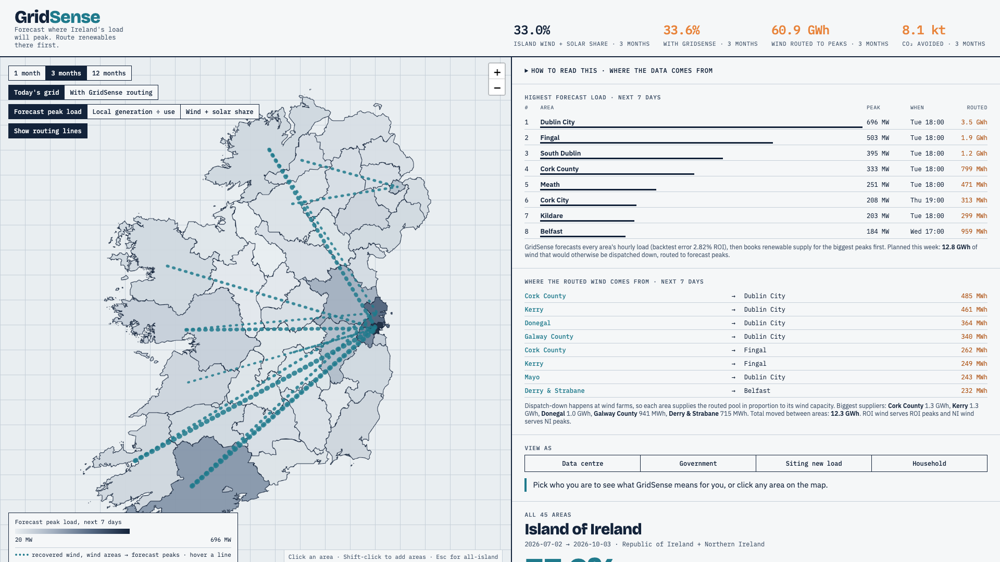
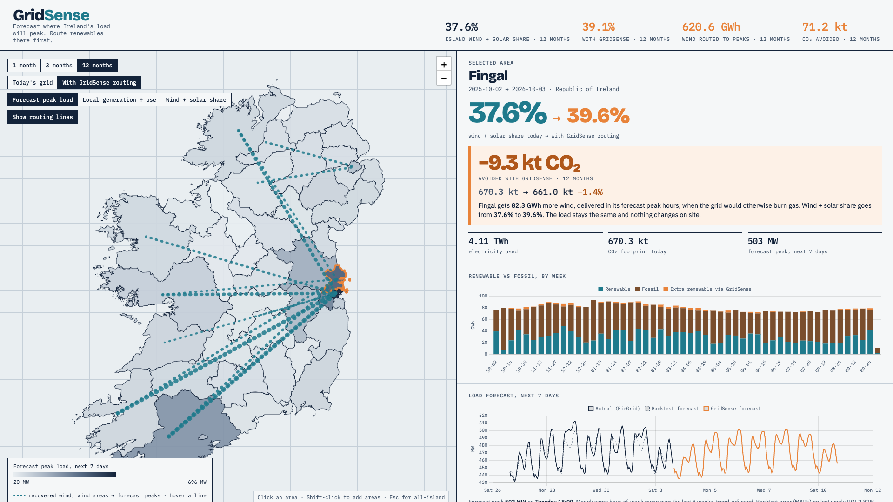

# GridSense

**Forecast where Ireland's load will peak. Route renewables there first.**

**[Live demo](https://gridsense-ireland-df3d7260a568.herokuapp.com/)** · **[Demo video](https://www.youtube.com/watch?v=chCNufY8-lY)** · **[Pitch deck](https://gridsense-ireland-df3d7260a568.herokuapp.com/deck/)** ([PDF](deck/GridSense-deck.pdf))



## The problem

Ireland's grid has a timing problem. Data centres now use **23.2%** of the Republic's metered electricity (CSO MEC02), 6.2× more than in 2015. Dublin hit a grid moratorium in 2022, and AWS had to build elsewhere. Meanwhile about **10% of Irish wind is dispatched down**, switched off because the power can't reach demand at the right moment. EirGrid only publishes grid-wide numbers, so nobody can see *where* and *when* the next peak will hit.

## What GridSense does (the moat)

1. **Forecast area by area.** Hourly load for each of the island's 45 areas (34 ROI local authorities and 11 NI districts), 7 days ahead. Backtest error is 2.8% in ROI and 5.5% in NI.
2. **Rank the peaks.** This week's top three: Dublin City 696 MW (Tue 18:00), Fingal 503 MW and South Dublin 395 MW.
3. **Route renewables there first.** Wind that would otherwise be dispatched down is booked for the biggest forecast peaks, scheduled through transmission and storage before the peak arrives. This week Cork County, Kerry, Donegal and Galway wind flows into Dublin, 12.8 GWh in all, and every flow on the map carries its number.
4. **Prove it hour by hour.** Each area gets an hourly-matched wind + solar share and CO₂ footprint, before and after. That's evidence for 24/7 carbon-free / Scope 2 claims, CRU connection policy and siting decisions.

Customers don't have to change their usage. Grid data is national; GridSense turns it into a local, forward-looking plan.



## Impact (modelled on 12 months of real EirGrid data, Oct 2025 – Oct 2026)

| | Today's grid | With GridSense |
|---|---|---|
| Island wind + solar share | 37.6% | **39.1%** |
| Wind put to work instead of dispatched down | | **621 GWh** |
| CO₂ avoided | | **71.2 kt** |
| Dublin–Meath data-centre corridor | 2.36 Mt CO₂ | **−33.8 kt** (299 GWh routed) |

**Who it's for:** data-centre operators (carbon proof, no change to operations); EirGrid, SONI, the CRU and government (where demand grows, where to build grid and renewables); industry siting new load (go where the wind is in surplus); households (how green your area's power really is).

## What's next

1. **Green-hour tokens.** Companies reserve priority access to renewable hours with tokens. That turns corporate social responsibility into a measurable, tradeable commitment, and funds new renewables.
2. **Canal micro-turbines.** Small in-flow turbines on Ireland's canals and water-management channels add steady local supply. GridSense maps where it would cover the biggest peaks.
3. **Live routing with EirGrid and SONI.** Real constraint data and generator lists replace our dispatch-down estimate, and routing runs against live forecasts.
4. **Per-Eircode precision.** ESB Networks smart-meter data takes forecasts from county to street level.
5. **Siting intelligence.** Point new data centres and factories to wind-surplus areas (Kerry, Donegal, Leitrim) before they apply to connect.

## Repo layout

| Path | What |
|---|---|
| `fetch_eirgrid.py` | Pulls 12 months of 15-min EirGrid Smart Grid Dashboard data (ROI + NI) into `raw/` |
| `build_data.py` | The model: area split, per-area forecast, peak ranking, routing, flows, self-check asserts. Writes `web/data.js` |
| `raw/` | Cached source data (EirGrid JSON, CSO MEC02/MEC03, OSi/OSNI boundaries), so the build is reproducible offline |
| `web/` | The dashboard (single static page: Leaflet + Chart.js) |
| `deck/` | Pitch deck (HTML + PDF) |

## Run it

```bash
python3 fetch_eirgrid.py && python3 build_data.py && open web/index.html
# or serve it:  python3 -m http.server -d web 8000   → http://localhost:8000
```

Python 3 stdlib only. `fetch_eirgrid.py` pulls the trailing 12 months into `raw/` (it caches files and refetches empty responses). `build_data.py` writes `web/data.js` and runs self-check asserts.

## Datasets

### Used in the prototype

| Dataset | Publisher | URL | What we use | Granularity | Access |
|---|---|---|---|---|---|
| Smart Grid Dashboard | EirGrid / SONI | `https://www.smartgriddashboard.com/api/chart/?region=ROI\|NI&chartType=default&dateRange=month&dateFrom=01-Sep-2026&dateTo=30-Sep-2026&areas=demandactual` and `...&areas=windactual,solaractual,co2intensity,windforecast` | System demand, wind actual, solar actual, CO₂ intensity, wind forecast, for ROI and NI separately | 15-min, Oct 2025 → Oct 2026 | JSON API, no key. **Max 4 fields per call**, so demand is fetched on its own |
| MEC02: Data Centres Metered Electricity Consumption | CSO | https://ws.cso.ie/public/api.restful/PxStat.Data.Cube_API.ReadDataset/MEC02/JSON-stat/2.0/en | Data-centre share of ROI metered electricity: **23.2%** (2025 Q1–Q4) | Quarterly, 2015 → | PxStat JSON-stat API |
| MEC03: Metered Electricity Consumption | CSO | https://data.cso.ie/table/MEC03 | 2025 consumption by county and Dublin postal district (`raw/cso_mec03.json`). Splits non-data-centre ROI demand across the 34 local authorities | County / postal district | Annual, 2015 → |
| Census 2022 population by local authority | CSO | https://data.cso.ie | Splits city/county pairs (Cork, Galway, Limerick, Waterford, Tipperary N/S) and "Co. Dublin" addresses | Local authority | Hard-coded (approx.) |
| Mid-2022 population estimates by LGD | NISRA | https://www.nisra.gov.uk/statistics/population | Splits NI demand across the 11 local government districts | LGD | Hard-coded (approx.) |
| County / local-authority boundaries (OSi) | Code for Germany *click_that_hood* | https://raw.githubusercontent.com/codeforgermany/click_that_hood/main/public/data/ireland-counties.geojson | ROI map polygons (34 local authorities) | Polygon | GeoJSON download |
| Local Government District boundaries (OSNI) | martinjc/UK-GeoJSON | https://raw.githubusercontent.com/martinjc/UK-GeoJSON/master/json/administrative/ni/lgd.json | NI map polygons (11 LGDs) | Polygon | GeoJSON download |

### Candidates for v2 (URLs checked live, Oct 2026)

- **CSO MEC01: metered electricity consumption, headline table.** https://data.cso.ie/table/MEC01 (the page loads, but the PxStat API path returned 404; use the CSV export from the table page)
- **EirGrid System and Renewable Data Reports.** Yearly/monthly XLSX with real dispatch-down (curtailment and constraint) by jurisdiction, which would replace our forecast-minus-actual proxy. https://www.eirgrid.ie/grid/system-and-renewable-data-reports
- **EirGrid connected and contracted generators list.** Per-site wind/solar capacity and county, which would replace our approximate county capacity weights. https://www.eirgrid.ie/industry/customer-information/connected-and-contracted-generators
- **SONI library.** NI equivalents of the generator lists and renewable reports. https://www.soni.ltd.uk/library
- **SEAI energy statistics.** National energy balance and renewable share for cross-checking. https://www.seai.ie/data-and-insights/seai-statistics
- **ESB Networks smart meter data.** Customers can download their own 30-min HDF file; there is no public per-Eircode feed. This is how a household or data centre would plug its own meter into GridSense. https://www.esbnetworks.ie/services/manage-my-meter
- **data.gov.ie.** Search for additional electricity and energy datasets. https://data.gov.ie/dataset?q=electricity
- **Open Data NI.** NI open-data portal. https://www.opendatani.gov.uk

## Model and assumptions

GridSense is hackathon-grade, and every assumption is named. Electrons on a meshed grid can't be steered to one address, so "routing" here means **scheduling transmission, storage and renewable allocation against a per-area peak forecast**, so recovered wind is booked for the areas whose load will peak highest. GridSense then reports, hour by hour, how much renewable energy each area actually consumed. Demand-side flex is an optional add-on, not part of the model.

- **System data** (demand, wind, solar, CO₂ intensity, wind forecast) is **real** 15-minute EirGrid data for ROI and NI.
- **Area demand** is system demand split by **real CSO MEC03 2025 metered consumption** per county and Dublin postal district (ROI; postal districts mapped to local authorities, "Not coded" large users left to the data-centre term) or NISRA population (NI), plus a flat data-centre baseload in ROI. That baseload is sized from CSO MEC02 (the real data-centre share of metered consumption) and placed where data centres cluster (Fingal, South Dublin, Dublin City, Meath, plus small shares in Kildare, Cork and Clare).
- **Baseline wind + solar share per area** (hydro and bioenergy excluded; EirGrid only publishes generation per grid, so every area on one grid draws the same hourly mix and shares differ only by load shape) is hourly-matched: `Σ_h load_a(h) · RES(h) / Σ_h load_a(h)`.
- **GridSense routing:**
  1. Forecast each area's load as the same-hour-of-week mean over the trailing 8 weeks, scaled by last week's trend.
  2. Rank areas by forecast peak and find each day's 6 forecast peak hours.
  3. Estimate the day's dispatch-down as wind forecast minus wind actual, counted only when renewables are at least 60% of demand (9.2% of ROI wind, 12.2% of NI; EirGrid reports ~10%).
  4. Route 50% of it (the network-constraint share, recoverable when transmission and storage are scheduled against the forecast) to the peak hours. Each area's share is weighted by its forecast peak², capped at its fossil load in those hours, with overflow re-shared, so the biggest peaks get first call.
  5. Attribute the routed wind to source areas in proportion to their wind capacity (dispatch-down happens at wind farms). This drives the flow lines and the "Where the routed wind comes from" table.
  6. Count CO₂ avoided at the real carbon intensity of each peak hour it displaces. Routing starts once 2 weeks of history exist.
- **Modelled, not measured:** per-area hourly demand split, county wind/solar capacity weights (used for local generation and flow sources), the dispatch-down proxy and the 50% recovery share. The v2 datasets above replace each one.
- **Forecast backtest** (MAPE on the last 7 days): ROI 2.8%, NI 5.5%.

## 3-minute demo script (live walkthrough)

| Time | Click | Say |
|---|---|---|
| 0:00 | Open https://gridsense-ireland-df3d7260a568.herokuapp.com/ (deck at `/deck/`). All-island map coloured by **Forecast peak load**. Open **How to read this · where the data comes from** | "This is the whole island, Republic and North, coloured by each area's highest forecast load over the next 7 days. Everything here is built from real 15-minute EirGrid data." |
| 0:20 | Point at **Highest forecast load · next 7 days** | "This is our core: a ranked forecast of where Ireland's load will peak. Dublin City tops it at 696 MW on Tuesday at 18:00, then Fingal at 503 MW. Backtested on last week, the forecast error is 2.8% in the Republic and 5.5% in Northern Ireland." |
| 0:50 | Click **Dublin City**, then **Fingal** | "Fingal is Ireland's data-centre heartland. CSO says data centres now use 23% of the Republic's metered electricity. GridSense books 1.9 GWh of recovered wind for Fingal's peaks this week, and the data centres don't change a thing." |
| 1:20 | Scenario → **With GridSense routing**, Period → **12 months** | "Turn on routing. The orange is wind EirGrid was dispatching down, scheduled into the forecast peaks instead. The 48-hour chart shows it landing exactly in the peak hours. Dublin City goes from 37.5% to 40.0% wind + solar." |
| 1:50 | Hover the thickest line, then read **Where the routed wind comes from**; shift-click **Kerry**, then **Donegal** | "Every line has a number: Cork County sends 485 MWh to Dublin City this week, Kerry 461. Cork, Kerry and Donegal supply 1.3, 1.3 and 1.0 GWh of the 12.8 GWh planned. Kerry and Donegal generate far more than they use. For lawmakers, this is the evidence: demand peaks in the east, supply sits in the west, so we need more grid and more renewables." |
| 2:30 | Press **Esc**, point at the header KPIs | "Across the island, from October 2025 to October 2026, GridSense lifts the wind + solar share from 37.6% to 39.1%. That's 621 GWh of wind that would have been wasted, and 71.2 kilotonnes of CO₂ avoided, with no new turbines. That's GridSense: forecast where Ireland's load will peak, and route renewables there first." |
